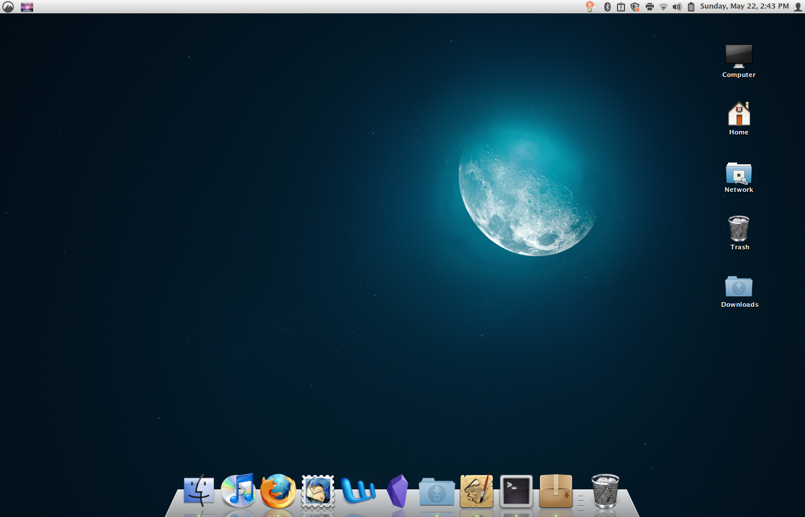

# Frost: a Docky theme

A frosted-glass theme for Docky, reminiscent of Mac OSX 10.6 or so.



## Installation

1. `git clone https://github.com/benchristel/docky-frost ~/.local/share/docky/themes/Frost`
2. `killall docky` and relaunch Docky.
3. Right-click the Docky icon in the dock and choose "Settings". Choose "Frost" from the dropdown labeled "Theme".

## Tips for installing Docky

In case you don't yet have Docky, here are the instructions for installing it
on Linux Mint 20.3 (might also work for other Ubuntu derivatives of a similar
vintage, circa 2022).

```
mkdir -p /tmp/docky
(
  cd /tmp/docky

  # install dependencies
  wget -c http://archive.ubuntu.com/ubuntu/pool/universe/g/gnome-sharp2/libgconf2.0-cil_2.24.2-4_all.deb
  wget -c http://archive.ubuntu.com/ubuntu/pool/main/g/glibc/multiarch-support_2.27-3ubuntu1_amd64.deb
  wget -c http://archive.ubuntu.com/ubuntu/pool/universe/libg/libgnome-keyring/libgnome-keyring-common_3.12.0-1build1_all.deb
  wget -c http://archive.ubuntu.com/ubuntu/pool/universe/libg/libgnome-keyring/libgnome-keyring0_3.12.0-1build1_amd64.deb
  wget -c http://archive.ubuntu.com/ubuntu/pool/universe/g/gnome-keyring-sharp/libgnome-keyring1.0-cil_1.0.0-5_amd64.deb
  sudo apt-get install ./*.deb

  # install docky
  wget -c http://archive.ubuntu.com/ubuntu/pool/universe/d/docky/docky_2.2.1.1-1_all.deb
  sudo apt-get install ./docky_2.2.1.1-1_all.deb
)
```

## How do I remove the Docky icon from the dock?

Install `gconf-editor` and run it. Under `/apps/docky-2/Docky/Items/DockyItem`,
uncheck the box for `ShowDockyItem`. Then restart Docky.

Of course, this makes it a bit harder to access Docky's settings. You can still
get to them by right-clicking a divider in the dock, or, if there's no divider,
by right-clicking the dock background near the edge.

